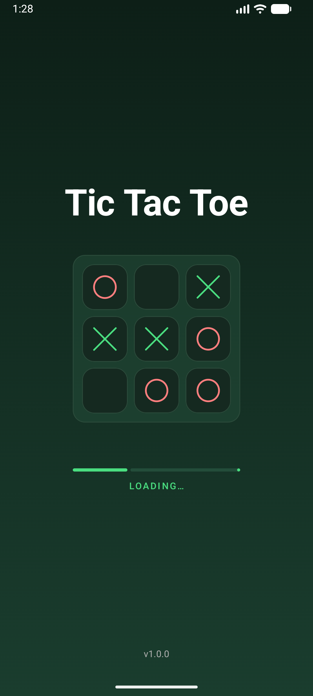
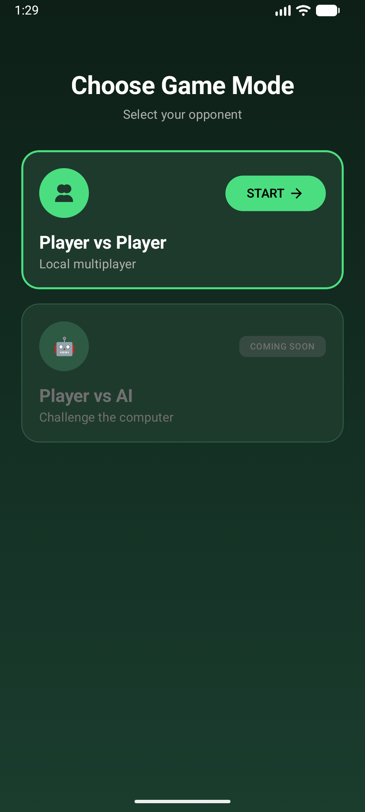
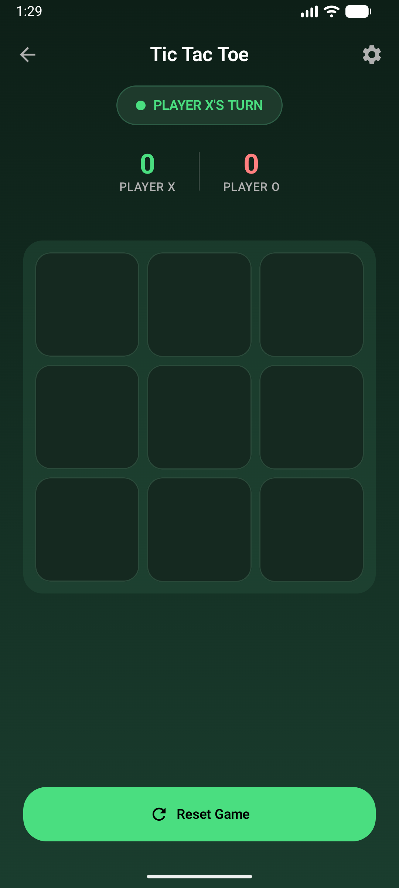
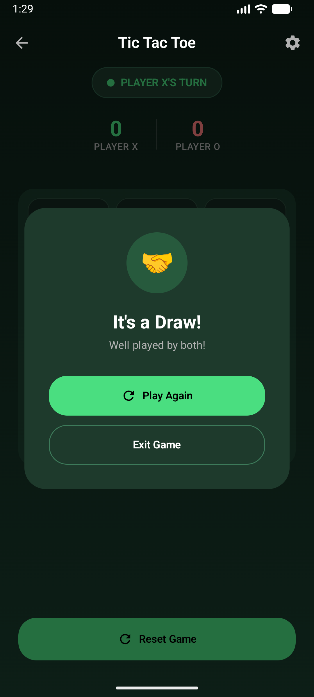
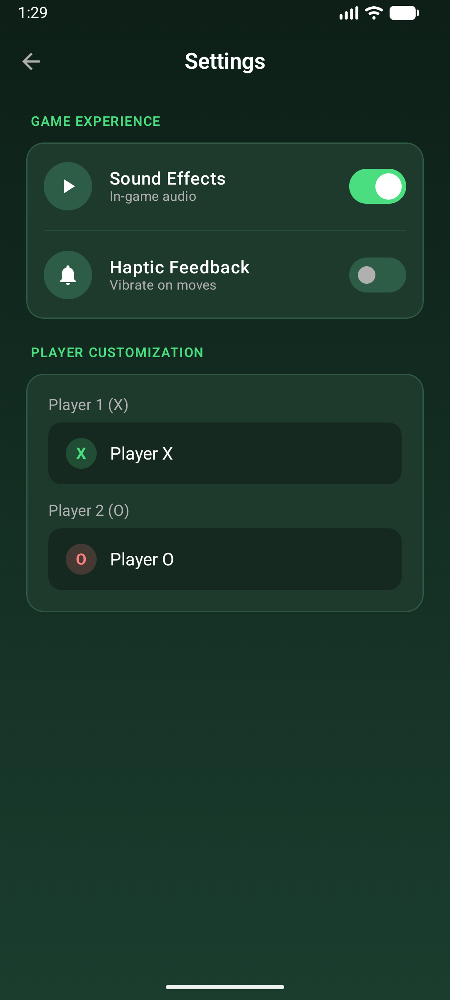

# Tic Tac Toe

A modern Android Tic Tac Toe game built with Jetpack Compose and Material 3 design.

## Screenshots

<p align="center">
  
  
  
  
  
</p>

## Features

- **Player vs Player** - Local multiplayer mode
- **Player vs AI** - Coming soon
- **Customizable Player Names** - Personalize your game experience
- **Sound Effects** - Toggle in-game audio
- **Haptic Feedback** - Vibration on moves (can be disabled)
- **Score Tracking** - Keep track of wins across sessions
- **Win Line Animation** - Visual feedback on winning combinations
- **Animated Splash Screen** - Dynamic board preview with pop-up animations
- **Dark Theme** - Beautiful dark green color scheme

## Tech Stack

| Technology | Purpose |
|------------|---------|
| **Kotlin** | Primary language |
| **Jetpack Compose** | Modern declarative UI |
| **Material 3** | Design system |
| **Koin** | Dependency injection |
| **DataStore** | Preferences persistence |
| **Navigation Compose** | Screen navigation |
| **ViewModel + StateFlow** | State management |

## Architecture

The app follows a clean architecture pattern with clear separation of concerns:

```
com.techgv.tictactoe/
├── data/
│   ├── model/          # Data classes (Player, GameState, GameResult, etc.)
│   └── repository/     # Data persistence (SettingsRepository)
├── di/                 # Koin dependency injection modules
├── domain/             # Business logic (GameLogic)
├── ui/
│   ├── components/     # Reusable UI components
│   ├── navigation/     # Navigation graph and routes
│   ├── screens/        # Screen composables and ViewModels
│   └── theme/          # Colors, typography, shapes
└── util/               # Utilities (SoundManager)
```

### Navigation Flow

```
Splash → GameMode → Game ↔ Settings
```

### Key Components

- **GameLogic** - Pure game logic: win detection, move validation, board state
- **GameViewModel** - Manages game state with StateFlow
- **SettingsRepository** - Persists user preferences via DataStore

## Requirements

- **Min SDK**: 24 (Android 7.0)
- **Target SDK**: 36
- **Java**: 11

## Build Instructions

```bash
# Build the project
./gradlew build

# Clean build
./gradlew clean build

# Install debug APK on connected device/emulator
./gradlew installDebug

# Run unit tests
./gradlew test

# Run instrumented tests (requires connected device/emulator)
./gradlew connectedAndroidTest
```

## Project Structure

```
app/
├── src/main/
│   ├── java/com/techgv/tictactoe/
│   │   ├── MainActivity.kt
│   │   ├── TicTacToeApplication.kt
│   │   ├── data/
│   │   ├── di/
│   │   ├── domain/
│   │   ├── ui/
│   │   └── util/
│   └── res/
│       ├── values/
│       │   └── strings.xml
│       └── ...
├── build.gradle.kts
└── proguard-rules.pro
```

## Credits

Sound Effect by [freesound_community](https://pixabay.com/users/freesound_community-46691455/?utm_source=link-attribution&utm_medium=referral&utm_campaign=music&utm_content=102220) from [Pixabay](https://pixabay.com/?utm_source=link-attribution&utm_medium=referral&utm_campaign=music&utm_content=102220)

## License

This project is for educational purposes.